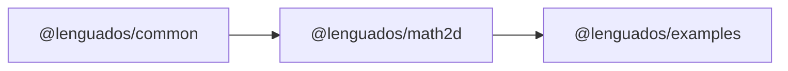

# Engine Architecture

Lenguados is a TypeScript monorepo for a deterministic, extensible 2D physics engine. This page describes the monorepo structure and shared infrastructure. For package internals, see each package's documentation.

## Monorepo Topology

```
lenguados/
  packages/
    math2d/     → @lenguados/math2d   Core 2D math library (main package)
    common/     → @lenguados/common   Shared utilities (parseJSONData)
    examples/   → @lenguados/examples Interactive demos and visual tests
  docs/           Docusaurus documentation site + TypeDoc API reference
  scripts/        Shared build scripts (build.mjs, clean.mjs, watch.mjs)
  openspec/       Spec-driven development workflow
```

## Package Dependency Graph



Dependencies flow left-to-right only. Each package is independently publishable to npm.

## Shared Infrastructure

| System      | Tool                            | Details                                                                 |
| ----------- | ------------------------------- | ----------------------------------------------------------------------- |
| **Build**   | Rollup 4 + SWC                  | Each package runs `scripts/build.mjs` → CJS + ESM + types in `lib/`     |
| **Testing** | Jest + @swc/jest + fast-check   | Two environments: `node` and `jsdom`                                    |
| **Linting** | ESLint 9 + Stylelint + Prettier | Enforced by lint-staged pre-commit hook                                 |
| **CI/CD**   | GitHub Actions                  | PR validation, release via Lerna, docs deploy to GitHub Pages           |
| **Docs**    | Docusaurus 3.10                 | Auto-generated API reference via TypeDoc, manual deep-dives per package |

## Design Principles

These principles apply across all packages in the engine:

1. **Determinism** — Cross-platform bit-exact results for networked lockstep. Each package chooses the appropriate deterministic strategy for its domain.
2. **Zero-Allocation** — No heap allocations in hot paths. Static methods accept `out` parameters; instance methods mutate `this`.
3. **Layered Protection** — Dev-only assertions (tree-shaked in production) combined with always-active safe fallbacks. Three tiers per fallible operation: strict, safe, unchecked.
4. **Modularity** — Independent packages for each engine layer. Use only what you need. Each package follows strict layered dependencies with unidirectional data flow.

## @lenguados/math2d Internals

The main package has a strict 6-layer architecture with unidirectional dependencies. See [`packages/math2d/ARCHITECTURE.md`](packages/math2d/ARCHITECTURE.md) for the full code map including:

- Layer diagram (deterministic → auxiliary → core → types → validation → utils)
- Key patterns (out parameter, triality, CS variants, apply vs transform)
- Zero-check conventions and tolerance constants

For expanded design principles and architectural axioms, see the [math2d architecture deep-dive](https://github.com/rndelpuerto/lenguados/blob/main/docs/docs/packages/math2d/architecture.md).
