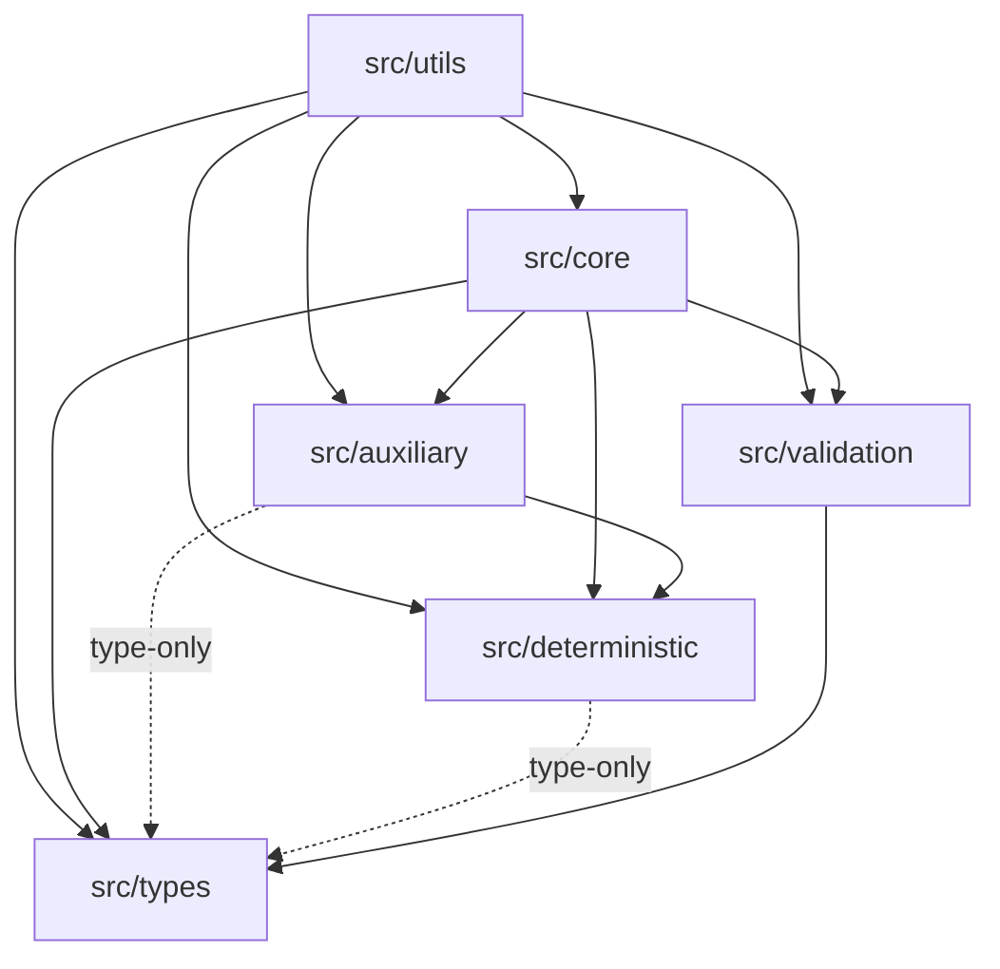

# @lenguados/math2d Architecture

This document is the concise code map for the `@lenguados/math2d` package. For expanded design principles and architectural axioms, see the [architecture deep-dive](../../docs/docs/math2d/architecture.md).

## Layering Strategy

The package is strictly layered to minimize circular dependencies and ensure a clean dependency graph.

### 1. Deterministic Layer (`src/deterministic`)

The massive bedrock. Contains pure, stateless mathematical kernels that guarantee cross-platform reproducibility.

- **Dependencies:** `src/types` (type-only: `SinCos` interface).
- **Responsibility:** Implement `sin`, `cos`, `tan`, `atan2`, `exp`, `log`, `pow`, `hypot` using polynomial approximations (fdlibm). `Math.sqrt` is IEEE 754 required (deterministic by standard) and used directly.

### 2. Auxiliary Layer (`src/auxiliary`)

Low-level stateless helpers.

- **Dependencies:** `src/deterministic`, `src/types` (type-only: `SinCos`).
- **Responsibility:**
  - `angle/`: Normalization (`normalizeRadians`), conversion (`degreesToRadians`), interpolation (`lerpAngle`), unwrapping.
  - `scalar/`: Constants, arithmetic (`clamp`, `remap`), comparison (`nearEquals`), interpolation (`lerp`, `smoothStep`).
  - `numeric/`: Safety guards (`divideSafe`, `reciprocalSafe`), rounding (`roundToPlaces`), wrapping (`flooredMod`).

### 3. Core Layer (`src/core`)

High-level object-oriented mathematical types.

- **Dependencies:** `src/auxiliary`, `src/deterministic`, `src/types`, `src/validation`.
- **Responsibility:**
  - Defines `Vector2`, `Rotation2`, `Complex`, `Interval`, `Matrix2`, `Matrix3`, `Transform2`.
  - Implements arithmetic, transformations, and geometric operations.
  - Integration point for most user interactions.

### 4. Types Layer (`src/types`)

Structural interfaces and type guards.

- **Dependencies:** None.
- **Responsibility:**
  - `*Like` interfaces (`ReadonlyVector2Like`, `Matrix3Like`, etc.) enabling duck-typed interop with POJOs.
  - Type guard functions (`isVector2Like`, `isMatrix2Like`, etc.).
  - `SinCos` / `ReadonlySinCos` interfaces.

### 5. Utils Layer (`src/utils`)

Optional tools.

- **Dependencies:** `src/core`, `src/auxiliary`, `src/deterministic`, `src/types`, `src/validation`.
- **Responsibility:**
  - `random`: `SeededRandomSource` (xoshiro128++) and type-specific generators (`randomVector2`, `randomRotation2`, etc.).
  - `parse`: String parsing and formatting per type.
  - `performance`: Benchmarking utilities.

### 6. Validation Layer (`src/validation`)

Development-time assertions.

- **Dependencies:** `src/types` only. Validation is a cross-cutting concern: it is imported BY `src/core` and `src/utils`, not the other way around.
- **Responsibility:** Runtime checks stripped in production builds.

---

## Key Patterns

### Allocation Control

To support high-performance game loops (60fps+), the library minimizes garbage collection pressure.

- **Static Methods:** Most logic is static to avoid `this` binding overhead in some contexts (though V8 optimizes this well now).
- **`out` Parameters:** Methods accept a destination object to write results into, avoiding `new` allocations.

### Strict/Safe/Unchecked Triality

Every fallible operation (e.g., normalization) follows the triality pattern:

1. `op()`: Strict, throws on error.
2. `opSafe()`: Returns safe fallback (suffix naming: `divideSafe`, `sqrtSafe`).
3. `opUnchecked()`: Fast, undefined behavior on error.

**Zero-check convention:** The safe variant guards the same condition as its strict counterpart — only the response differs (throw vs fallback). Two tiers exist:

- **Scalar arithmetic** (`inverseLerp`, `floorDivide`, `remap`, `Interval.divideScalar`): Both strict and safe use `=== 0`. Only exact zero is mathematically undefined; any non-zero denominator produces a valid result.
- **Core type operations** (`Vector2.normalize`, `Matrix.inverse`, `Transform.inverse`): Both strict and safe use `isNearZero()` (EPSILON = 1e-10). Near-zero magnitudes/determinants produce numerically degenerate results in geometric contexts.
- **`flooredMod`** is an exception: uses `isNearZero()` even though it's in the auxiliary layer, because modulo with near-zero divisors produces floating-point noise (the mathematical result is 0, but IEEE 754 arithmetic returns a random-looking value bounded by the divisor).

**Tolerance constants:** `EPSILON` (1e-10) and `MIN_SAFE_DIVISOR` (1e-10) are independently defined constants that intentionally share the same value. `EPSILON` is the geometric comparison tolerance; `MIN_SAFE_DIVISOR` is the division safety threshold used by `divideSafe` and `reciprocalSafe`. They are decoupled so that changing one does not silently affect the other. (Common values in the industry range from `1e-8` to `~1.19e-7` for float32; our `1e-10` is more conservative for double precision.)

### Semantic Naming

- **`apply`**: Apply an operator (Rotation) to an operand (Vector).
- **`transform`**: Transform a point through a coordinate space (Matrix).
