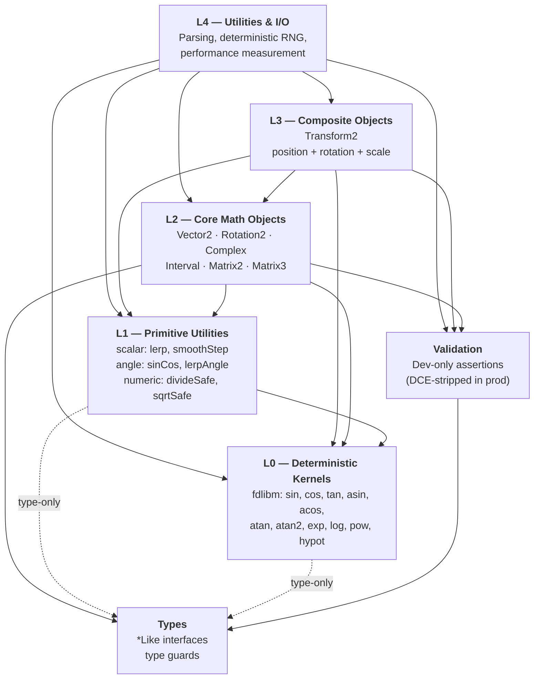

# Architecture

This page provides the expanded design rationale and architectural axioms behind `@lenguados/math2d`. For the concise code map (layer graph, key patterns, and quick reference), see [`packages/math2d/ARCHITECTURE.md`](https://github.com/rndelpuerto/lenguados/blob/main/packages/math2d/ARCHITECTURE.md).

---

## Vision

> "Ser la base matematica estricta y eficiente para generar nuevos modulos y paquetes, siendo rigurosa, cientificamente comprobable, robusta, escalable, extensible y con acceso a los Hot-Paths del CPU."

_Translation: "To be the strict, efficient mathematical foundation for generating new modules and packages -- rigorous, scientifically verifiable, robust, scalable, extensible, and with access to CPU hot-paths."_

---

## Design Principles

The package is governed by four normative axioms that shape every API decision.

### 1. Strict Mathematics

All formulas are verifiable and use scientific nomenclature. The library adopts counter-clockwise (CCW) positive rotation, a Y-up coordinate system, angles in radians, and column-major matrices. Transform order is always Scale, then Rotate, then Translate.

### 2. Zero-Allocation

GC thrashing in hot paths is eliminated by design. Static methods accept an optional `out` parameter so callers can reuse pre-allocated objects instead of creating new ones on every call. Instance methods mutate `this` and return `this` for chainable, allocation-free usage.

### 3. Two-Layer Protection

A dual-layer validation architecture protects developers in development while imposing zero overhead in production:

- **Layer 1 -- Assertions (dev-only):** Functions such as `assertFinite` and `assertNonZero` are guarded by `process.env.NODE_ENV !== 'production'`. Standard minifiers (Vite, Webpack, SWC) strip them entirely from production bundles via Dead Code Elimination.
- **Layer 2 -- Safe functions (always active):** Functions like `divideSafe`, `sqrtSafe`, and other `*Safe()` variants remain in production. They return a neutral fallback value on failure (e.g., `(0, 0)` for a collapsed vector) instead of propagating `NaN` through a simulation.

### 4. Deterministic Toggle

Cross-platform synchronization (e.g., network lockstep) and local single-player performance are opposing concerns. The library resolves this with a runtime kill-switch: `config.useNativeMath`. See the [Deterministic Toggle](#deterministic-toggle) section below for full details.

---

## Layered Architecture

The package is strictly segregated into unidirectional layers -- dependencies flow downward only; each layer may only import from layers below it.



---

## Core Design Patterns

### Static vs Instance (Mutation Policy)

- **Static methods** are pure and immutable. They return new instances unless an `out` parameter is provided.
- **Instance methods** mutate `this` and return `this` strictly to enable high-performance method chaining.
- **Constant immutability:** Global static constants (e.g., `Vector2.ZERO`, `Matrix3.IDENTITY`) use `Object.freeze()`. Attempting to mutate `Vector2.ZERO.add(v)` throws a `TypeError` in strict mode, protecting universal state.

```typescript
// STATIC: Pure, allocation-free with `out`
Vector2.add(a, b, preallocatedVector);

// IMPOSSIBLE: Throws TypeError (cannot assign to read-only properties)
Vector2.ZERO.add(b);

// INSTANCE: Mutates, chainable
velocity.add(acceleration).multiplyScalar(dt);
```

### Pre-computed Trigonometry (\*CS Pattern)

Avoid calling `sin` and `cos` multiple times inside loops. Pre-compute once, then pass the values to `*CS` variants.

```typescript
const { cos, sin } = sinCos(angle);
for (const v of vectors) {
 v.rotateCS(cos, sin); // ~6x faster than .rotate(angle)
}
```

### Factory (`from*`) and Conversion (`to*`)

- `Rotation2.fromAngle()`, `Transform2.fromMatrix3()`
- `rotation.toComplex()`, `transform.toRotation2()`

**Rotation2 constructor architecture:** The constructor `new Rotation2(cos, sin)` deliberately omits magnitude validation (auto-normalization). Massive iterations incur "drift" (departure from the unit circle due to IEEE 754 error). The architecture delegates absolute responsibility to the consuming developer, who must explicitly call `.normalize()` periodically.

---

## DCE Policy

Dead Code Elimination (DCE) is a first-class architectural concern. The two-layer protection system described above is designed specifically to work with standard JavaScript bundlers.

**How it works:**

1. All dev-only assertion code is wrapped in `process.env.NODE_ENV !== 'production'` guards.
2. When bundlers (Vite, Webpack, SWC, etc.) build for production, they statically evaluate the guard to `false` and remove the entire block.
3. The result is zero-overhead validation: full runtime checks during development, completely stripped in production bundles.

**Layer 2 (`*Safe` functions) are never eliminated.** They represent the production safety net -- always active, always returning neutral fallback values rather than propagating `NaN` or throwing exceptions. This separation ensures that simulation stability is never sacrificed for bundle size.

---

## Deterministic Toggle

By default, `@lenguados/math2d` routes all critical transcendental functions (`sin`, `cos`, `atan2`, `hypot`, `exp`, `log`, `pow`) through **fdlibm bit-exact** (polynomial) implementations abstracted from JavaScript. `Math.sqrt` is used directly because it is an IEEE 754 _required_ operation (correctly rounded, deterministic by standard).

**Benefit:** Perfect network synchronization in lockstep architectures.
**Cost:** Variable overhead compared to native `Math.*` builtins (which themselves use C++ fdlibm in V8). Measured via the `deterministic` benchmark suite with `fdlibm` vs `native` dimensions.

### Bypassing for Single-Player / Local Hardware

The core exposes the configuration object `config.useNativeMath`, which short-circuits the polynomial kernels and hands execution back to the browser's native `Math.*` implementations (backed by C++ FPU instructions).

```typescript
import { config } from '@lenguados/math2d';

// At your application's startup for single-player mode:
config.useNativeMath = true;
```

When `useNativeMath` is `true`, calls to `sin`, `cos`, and other transcendental functions resolve to the platform's native `Math` methods. This recovers the fdlibm overhead at the cost of cross-platform bit-exactness. Use this only when deterministic reproducibility across different hardware/browsers is not required.

---

## Internal Module Policies

For the classification framework, decision criteria, and build mechanics behind internal modules, see [Module Exports & Internals](../../guides/module-exports). For the specific classification decisions applied to this package, see [Module Exports & Internals -- math2d](./module-exports).

### Iron Rule for `utils/`

The `utils/` directory provides cross-cutting functionality (parsing, RNG, performance measurement). These utilities must **never** be duplicated as static methods on core classes. For example, `Vector2.parse()` is strictly prohibited -- parsing lives exclusively in `utils/parse.ts`.

### Parser Optimization (RegEx Fast-Path)

The `utils/parse.ts` module uses **RegEx fast-paths** for type-specific parsing.

**Rationale:** V8 TurboFan aggressively de-optimizes `try-catch` blocks that throw exceptions. In a 60 FPS game loop, failed `JSON.parse` calls with stack trace generation are prohibitively expensive.

**Solution:** Structural evaluation (e.g., `/"x"\s*:/i.test(...)`) is performed before attempting `JSON.parse`. This avoids costly stack traces and keeps the parser on V8's fast path.
