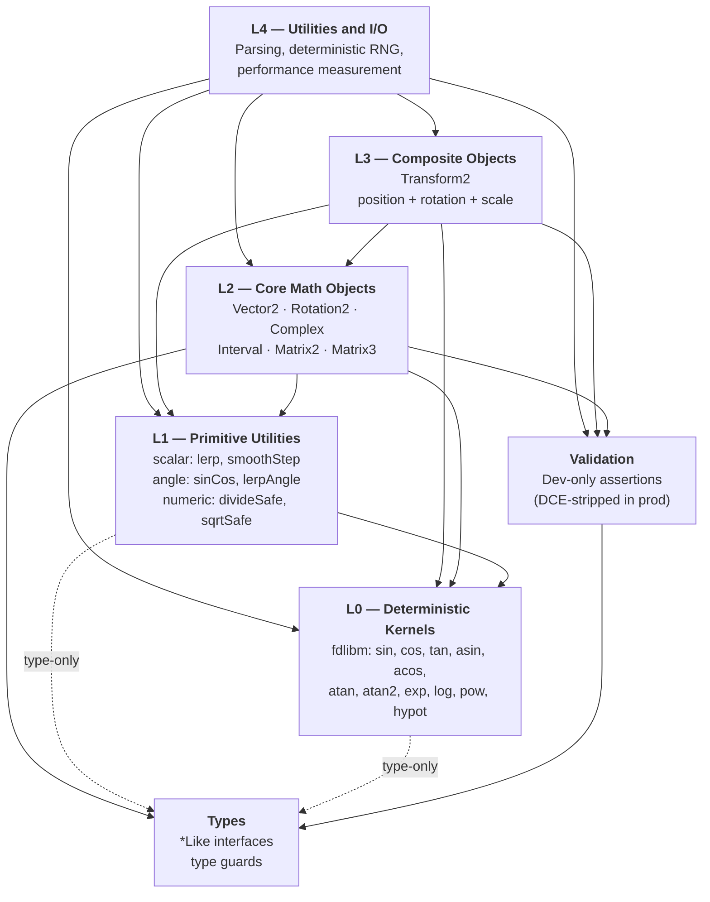

# @lenguados/math2d Architecture

Package-level architecture for `@lenguados/math2d`: layer topology, design axioms, core patterns, and policy rationale. This document is the authoritative architectural reference for the package. The monorepo-level topology lives at the root [`ARCHITECTURE.md`](../../ARCHITECTURE.md); engine-wide standards that this package extends live under the root standards (`DESIGN_PHILOSOPHY.md`, `TSDOC_STANDARD.md`, `TESTING_STRATEGY.md`, `MODULE_EXPORTS.md`).

---

## Vision

> "Ser la base matematica estricta y eficiente para generar nuevos modulos y paquetes, siendo rigurosa, cientificamente comprobable, robusta, escalable, extensible y con acceso a los Hot-Paths del CPU."

_Translation: "To be the strict, efficient mathematical foundation for generating new modules and packages — rigorous, scientifically verifiable, robust, scalable, extensible, and with access to CPU hot-paths."_

---

## Design Principles

The package is governed by four normative axioms that shape every API decision.

### 1. Strict Mathematics

All formulas are verifiable and use scientific nomenclature. The library adopts counter-clockwise (CCW) positive rotation, a Y-up coordinate system, angles in radians, and column-major matrices. Transform order is always Scale, then Rotate, then Translate.

### 2. Zero-Allocation

GC thrashing in hot paths is eliminated by design. Static methods accept an optional `out` parameter so callers can reuse pre-allocated objects instead of creating new ones on every call. Instance methods mutate `this` and return `this` for chainable, allocation-free usage.

### 3. Two-Layer Protection

A dual-layer validation architecture protects developers in development while imposing zero overhead in production:

- **Layer 1 — Assertions (dev-only):** Functions such as `assertFinite` and `assertNonZero` are wrapped at every call site in `if (__LENGUADOS_DEV__) { ... }` blocks that are eliminated from production library bundles at the library build step — see the [DCE Policy](#dce-policy) section for the mechanism and [Design Decisions ADR-017](DESIGN_DECISIONS.md) for the rationale.
- **Layer 2 — Safe functions (always active):** Functions like `divideSafe`, `sqrtSafe`, and other `*Safe` variants remain in production. They return a neutral fallback value on failure (for example `(0, 0)` for a collapsed vector) instead of propagating `NaN` through a simulation.

### 4. Deterministic Toggle

Cross-platform synchronization (network lockstep) and local single-player performance are opposing concerns. The library resolves this with a runtime kill-switch: `config.useNativeMath`. See the [Deterministic Toggle](#deterministic-toggle) section for full details.

---

## Layered Architecture

The package is strictly segregated into unidirectional layers — dependencies flow downward only; each layer may only import from layers below it.



### L0 — Deterministic Kernels (`src/deterministic`)

The bedrock of the package. Pure, stateless mathematical kernels that guarantee cross-platform reproducibility.

- **Dependencies:** `src/types` (type-only: `SinCos` interface).
- **Responsibility:** Implement `sin`, `cos`, `tan`, `asin`, `acos`, `atan`, `atan2`, `exp`, `log`, `pow`, `hypot`, `sinh`, `cosh`, `tanh` using polynomial approximations (fdlibm). `Math.sqrt`, `Math.floor`, `Math.ceil`, `Math.abs`, `Math.min`, `Math.max`, `Math.round`, `Math.trunc`, `Math.sign` are IEEE 754-required operations and are used directly from native `Math`. The combined `sinCos` kernel also lives at this level; the `sinCos` exported from the package barrel is the L1 `auxiliary/angle` wrapper with the identical `(angle, out?)` contract, delegating to this kernel.

### L1 — Auxiliary (`src/auxiliary`)

Low-level stateless helpers built on top of L0.

- **Dependencies:** `src/deterministic`, `src/types` (type-only).
- **Responsibility:**
  - `angle/` — normalization (`normalizeRadians`), conversion (`degreesToRadians`), interpolation (`lerpAngle`), unwrapping.
  - `scalar/` — constants, arithmetic (`clamp`, `mod`, `floorDivide`), comparison (`nearEquals`), interpolation (`lerp`, `smoothStep`).
  - `numeric/` — safety guards (`divideSafe`, `reciprocalSafe`), rounding (`roundToPlaces`), wrapping (`flooredMod`).

### L2 — Core (`src/core`)

High-level object-oriented mathematical types.

- **Dependencies:** `src/auxiliary`, `src/deterministic`, `src/types`, `src/validation`.
- **Responsibility:**
  - Defines `Vector2`, `Rotation2`, `Complex`, `Interval`, `Matrix2`, `Matrix3`.
  - Implements arithmetic, transformations, decompositions, and geometric operations.
  - Integration point for most user interactions.

### L3 — Composite (`src/core/transform2`)

Composite objects that combine multiple L2 types.

- **Dependencies:** `src/core` (L2), plus everything L2 depends on.
- **Responsibility:**
  - `Transform2` — stores position (`Vector2`), rotation (`Rotation2`), and scale (`Vector2`) as a lightweight SRT body for 2D sprites and rigid bodies. Escalates to `Matrix3` when shear or non-uniform transforms are required (see [Interoperability](INTEROPERABILITY.md)).

### L4 — Utils (`src/utils`)

Optional tools layered on top of the math core.

- **Dependencies:** `src/core`, `src/auxiliary`, `src/deterministic`, `src/types`, `src/validation`.
- **Responsibility:**
  - `random/` — `SeededRandomSource` (xoshiro128++), `MathRandomSource`, and type-specific generators (`randomVector2`, `randomRotation2`, etc.).
  - `parse/` — string parsing and formatting per type.

### Types (cross-cutting, `src/types`)

Structural interfaces and type guards that enable duck-typed interop with plain objects.

- **Dependencies:** none.
- **Responsibility:** `*Like` interfaces (`ReadonlyVector2Like`, `Matrix3Like`, etc.) and type guard functions (`isVector2Like`, `isMatrix2Like`, etc.). `SinCos` / `ReadonlySinCos` interfaces.

### Validation (cross-cutting, `src/validation`)

Development-time assertions and non-throwing predicates. Validation is imported BY `src/core` and `src/utils`, not the other way around.

- **Dependencies:** `src/types` only.
- **Responsibility:** runtime assertion functions (`assertFinite`, `assertNonNegative`, `assertVector2Like`, etc.) wrapped at call sites by the `__LENGUADOS_DEV__` build-time constant and eliminated from production library bundles (see [DCE Policy](#dce-policy)). The `validation/shapes` subpath re-exports shape assertions for external consumers that need runtime shape validation.

---

## Core Design Patterns

### Static vs Instance (Mutation Policy)

- **Static methods** are pure and immutable. They return new instances unless an `out` parameter is provided.
- **Instance methods** mutate `this` and return `this` strictly to enable high-performance method chaining.
- **Constant immutability:** Global static constants (`Vector2.ZERO`, `Matrix3.IDENTITY`) use `Object.freeze`. Attempting to mutate `Vector2.ZERO.add(v)` throws a `TypeError` in strict mode, protecting universal state.

```typescript
// STATIC: Pure, allocation-free with `out`
Vector2.add(a, b, preallocatedVector);

// IMPOSSIBLE: Throws TypeError (cannot assign to read-only properties)
Vector2.ZERO.add(b);

// INSTANCE: Mutates, chainable
velocity.add(acceleration).multiplyScalar(dt);
```

### Pre-computed Trigonometry (`*CS` pattern)

Avoid calling `sin` and `cos` multiple times inside loops. Pre-compute once, then pass the values to `*CS` variants. Canonical members: `Vector2.rotateCS`, `Vector2.fromAngleCS`, `Rotation2.multiplyCS`, `Rotation2.applyCS`, `Complex.multiplyCS`, `Complex.fromPolarCS`, `Transform2.transformPointCS`, `Transform2.transformVectorCS`, `Transform2.transformDirectionCS`. The matrix factories need no `*CS` variant: `Matrix2.fromRotation` and `Matrix3.fromRotation` accept a `ReadonlyRotation2Like`, whose `cos` / `sin` fields are already the pre-computed pair — pass a `{ cos, sin }` object literal directly.

```typescript
const { cos, sin } = sinCos(angle);
for (const v of vectors) {
 v.rotateCS(cos, sin); // Avoids the per-iteration trig of v.rotate(angle) — see the benchmark lab
}
```

The `*CS` form IS the Unchecked tier of its non-CS counterpart; callers own any normalization invariant. Parameter order is `(subject, cos, sin, out?)`.

### Factories (`from*`) and Conversions (`to*`)

Every core class exposes static factories using the `from*` prefix and instance conversions using the `to*` prefix. Factories construct a type from other data; conversions emit a new representation:

- `Rotation2.fromAngle(angle)`, `Transform2.fromMatrix3(m)`
- `rotation.toComplex()`, `transform.toMatrix3()`

**Cross-class conversions cluster on the dependent class.** The class that already imports the other (the "dependent") owns BOTH the `from*` static factory and the `to*` instance conversion for that pair. The independent class MAY expose `from*` factories that accept `Readonly*Like` inputs (no concrete class import needed — factories construct `this` using the Like interface's field access) but MUST NOT expose `to*` instance methods that return a foreign class, because doing so forces the reverse `new ForeignClass()` constructor call and introduces a runtime class cycle that the layered architecture prohibits (see the [Layered Architecture](#layered-architecture) section above).

Concrete examples in the current source:

- `Rotation2.fromComplex(c)` + `rotation.toComplex()` both live on `Rotation2`, which imports `Complex` concretely. `Complex` does NOT import `Rotation2` and does NOT expose `Complex.prototype.toRotation2` — the asymmetry is intentional and prevents the cycle.
- `Matrix2.fromOuterProduct(u, v)` is the canonical rank-1 outer-product factory; there is no `Vector2.outerProduct(u, v)` delegate because adding one would force `Vector2 → Matrix2` import, inverting the within-core layer ordering where `Matrix2` operates on `Vector2`.

Consumers who need the reverse direction construct the target type directly — for example, `new Complex(rotation.cos, rotation.sin)` or `Matrix2.fromOuterProduct(u, v)` — rather than relying on a reciprocal instance method that would couple the classes bidirectionally.

**Rotation2 constructor architecture:** The constructor `new Rotation2(cos, sin)` deliberately omits magnitude validation (auto-normalization). Massive iterations incur drift — departure from the unit circle due to IEEE 754 error. The architecture delegates absolute responsibility to the consuming developer, who must explicitly call `.normalize()` periodically.

### Allocation Control (`out` Parameter and `ensureOut`)

Static methods accept `out?: T` as the last parameter for allocation-free hot paths. Every core class has a private static helper:

```typescript
private static ensureOut(out?: T): T { return out ?? new T(); }
```

The static method body pattern is `return this.ensureOut(out).set(computedX, computedY)`. Input parameters use `Readonly*Like` interfaces (duck typing); return type is the concrete class.

### Strict / Safe / Unchecked Triality

Every fallible operation follows the triality pattern:

1. `op()` — strict, throws on invalid input (default).
2. `opSafe()` — returns a neutral fallback, never throws.
3. `opUnchecked()` — no validation; undefined behavior on invalid input (IEEE 754 "Garbage In, Garbage Out" contract).

The triality enables simulation code (for example a physics solver that guarantees non-zero inputs) to run the Unchecked path for linear CPU execution, while application-level code uses Safe for robustness and default for development-time error detection.

**Code duplication across tiers is intentional.** `normalizeSafe` and `normalizeUnchecked` duplicate the math from `normalize`. This eliminates branch-prediction misses in hot paths. Do not refactor these into a shared implementation — the duplication is a deliberate performance choice.

### `sqrt` vs `hypot` Convention

Magnitude computation has two tiers, aligned with the validation triality:

- **Default and Safe methods** use `hypot(x, y)` from deterministic kernels — overflow-safe: it stays finite for any representable magnitude up to `Number.MAX_VALUE` $\approx 1.80 \times 10^{308}$.
- **Unchecked methods** use `Math.sqrt(x * x + y * y)` (faster, no function-call overhead) — the squared intermediate overflows once a single component exceeds $\sqrt{\mathtt{Number.MAX\_VALUE}} \approx 1.34 \times 10^{154}$ (or $\approx 9.5 \times 10^{153}$ when both components are comparable); the caller guarantees no overflow.

Examples:

- `Vector2.magnitude` / `normalize` / `normalizeSafe` use `hypot(x, y)`.
- `Vector2.normalizeUnchecked` / `directionUnchecked` / `setMagnitudeUnchecked` use `Math.sqrt(x*x + y*y)`.
- `Rotation2.normalize` / `normalizeSafe` use `hypot(cos, sin)`.
- `Rotation2.normalizeUnchecked` uses `Math.sqrt(cos*cos + sin*sin)`.

Matrix Frobenius paths (`Matrix2.frobeniusNorm`, `Matrix2.eigenvectorForValue`) follow the same convention: default and Safe tiers use `hypot(hypot(m00, m01), hypot(m10, m11))`; Unchecked uses raw `Math.sqrt` with the raw sum of squares.

---

## Zero-Check Convention and Tolerances

The Safe variant guards the same condition as its strict counterpart — only the response differs (throw vs. fallback). Two tiers exist across the package:

- **Scalar arithmetic** (`inverseLerp`, `floorDivide`, `Interval.divideScalar`, `flooredMod`): Both strict and safe use `=== 0`. Only exact zero is mathematically undefined; any non-zero denominator produces a valid result per IEEE 754.
- **Core type operations** (`Vector2.normalize`, `Matrix.inverse`, `Transform.inverse`): Both strict and safe use `isNearZero` with `EPSILON` = $1 \times 10^{-10}$. Near-zero magnitudes or determinants produce numerically degenerate results in geometric contexts.

**Tolerance constants.** `EPSILON` ($1 \times 10^{-10}$) and `MIN_SAFE_DIVISOR` ($1 \times 10^{-10}$) are independently defined constants that intentionally share the same value. `EPSILON` is the geometric comparison tolerance; `MIN_SAFE_DIVISOR` is the division safety threshold used by `divideSafe` and `reciprocalSafe`. They are decoupled so that changing one does not silently affect the other.

---

## DCE Policy

Dead Code Elimination is a first-class architectural concern. The two-layer protection system described above produces the production tree independent of the consumer's bundler.

1. All dev-only assertion code is wrapped at every call site in `if (__LENGUADOS_DEV__) { ... }` blocks.
2. The build-time constant substitution (configured in `rollup.config.mjs`) replaces `__LENGUADOS_DEV__` with the literal `false` for production library builds (and `true` for development builds); the build pipeline minifier then eliminates the resulting `if (false) { ... }` blocks at the library build step — call sites, label strings, and assertion bodies all removed.
3. The result is zero-overhead validation: full runtime checks during development, completely stripped from `lib/cjs/index.production.js` and `lib/esm/module.js` regardless of the consumer's bundler. See [Design Decisions ADR-017](DESIGN_DECISIONS.md).

Layer 2 (`*Safe` functions) are **never** eliminated. They represent the production safety net — always active, always returning neutral fallback values rather than propagating `NaN` or throwing exceptions. This separation ensures that simulation stability is never sacrificed for bundle size.

---

## Deterministic Toggle

By default, `@lenguados/math2d` routes all critical transcendental functions (`sin`, `cos`, `atan2`, `hypot`, `exp`, `log`, `pow`) through bit-exact polynomial implementations derived from the fdlibm public-domain library. `Math.sqrt` is used directly because it is an IEEE 754 required operation (correctly rounded, deterministic by standard).

**Benefit:** perfect cross-platform reproducibility in lockstep architectures.
**Cost:** variable overhead compared to native `Math.*` builtins.

### Bypassing for single-player and local hardware

The package exposes the configuration object `config.useNativeMath`, which short-circuits the polynomial kernels and hands execution back to the browser or runtime's native `Math.*` implementations.

```typescript
import { config } from '@lenguados/math2d';

// At application startup, before any math is performed:
config.useNativeMath = true;
```

When `useNativeMath` is `true`, calls to `sin`, `cos`, and other transcendental functions resolve to the platform's native `Math` methods. This recovers the fdlibm overhead at the cost of cross-platform bit-exactness. Use this only when deterministic reproducibility across different hardware or browsers is not required. Set once at startup — never toggle mid-computation.

---

## Internal Module Policies

For the engine-wide classification framework, decision criteria, and build mechanics behind internal modules, see the root [Module Exports & Internals](../../MODULE_EXPORTS.md) guide. For the package-specific classification decisions, see the companion [`MODULE_EXPORTS.md`](MODULE_EXPORTS.md) in this directory.

### Iron Rule for `utils/`

The `utils/` directory provides cross-cutting functionality (parsing, RNG, performance measurement). These utilities **MUST NOT** be duplicated as static methods on core classes. For example, `Vector2.parse` is strictly prohibited — parsing lives exclusively in `utils/parse.ts`.

### Parser Optimization (RegEx Fast-Path)

The `utils/parse.ts` module uses RegEx fast-paths for type-specific parsing.

**Rationale:** JIT optimizers aggressively de-optimize `try-catch` blocks that throw exceptions. In a 60 FPS game loop, failed `JSON.parse` calls with stack-trace generation are prohibitively expensive.

**Solution:** structural evaluation (for example `/"x"\s*:/i.test(...)`) is performed before attempting `JSON.parse`. This avoids costly stack traces and keeps the parser on the engine fast path.

---

## Semantic Naming

- **`apply`** — operators acting on operands. `Rotation2.apply(rotation, vector)` applies the rotation to the vector.
- **`transform`** — spatial coordinate changes. `Matrix3.transformPoint(matrix, point)` transforms the point's coordinate space through the matrix.

This distinction is consistently applied across the package: operators use `apply`; coordinate transformations use `transform`.
