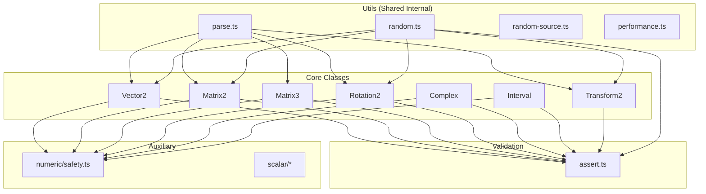

# @lenguados/math2d — Architecture Policy for Utils & Validation

> **Document Date:** December 25, 2025  
> **Purpose:** Definitive architectural policy for shared modules  
> **Scope:** utils/, validation/, and their usage patterns across the package

---

## Executive Summary

Este documento establece la **política arquitectónica definitiva** para los módulos compartidos internos:

| Module        | Purpose                   | Usage Policy                    |
| ------------- | ------------------------- | ------------------------------- |
| `utils/`      | Shared internal utilities | **NO** duplicar en core classes |
| `validation/` | Dev-time assertions       | **DEBE** usarse para validación |

---

## 1. Utils Module — Shared Internal Utilities

### 1.1 Design Philosophy

El directorio `utils/` es un **módulo interno compartido** que provee funcionalidades transversales. Estas funcionalidades **NO deben duplicarse** en las clases core.

```
utils/
├── parse.ts         # Parsing & formatting de todas las clases
├── random.ts        # Generación random de todas las clases
├── random-source.ts # Fuentes de random (LCG, default)
└── performance.ts   # Medición de performance
```

### 1.2 Architectural Rules

> [!IMPORTANT]
> **Rule 1: No Duplication in Core**
>
> Las funcionalidades de utils **NO deben** ser añadidas como métodos de instancia/estáticos en las clases core. En su lugar, utils provee estas funcionalidades para todas las clases.

**❌ INCORRECTO (No hacer esto):**

```typescript
// core/vector2.ts — NO HACER
class Vector2 {
  static parse(str: string): Vector2 { ... }
  static random(): Vector2 { ... }
}
```

**✅ CORRECTO (Usar utils):**

```typescript
// utils/parse.ts — Centralizado
export function parseVector2(str: string): Vector2 { ... }

// utils/random.ts — Centralizado
export function randomVector2(): Vector2 { ... }
```

### 1.3 Current Implementation Status

#### parse.ts (640 lines)

| Function           | Type       |    Status    |
| ------------------ | ---------- | :----------: |
| `parseVector2`     | Vector2    |      ✅      |
| `formatVector2`    | Vector2    |      ✅      |
| `parseRotation2`   | Rotation2  |      ✅      |
| `formatRotation2`  | Rotation2  |      ✅      |
| `parseMatrix2`     | Matrix2    |      ✅      |
| `formatMatrix2`    | Matrix2    |      ✅      |
| `parseMatrix3`     | Matrix3    |      ✅      |
| `formatMatrix3`    | Matrix3    |      ✅      |
| `parseTransform2`  | Transform2 |      ✅      |
| `formatTransform2` | Transform2 |      ✅      |
| `parseComplex`     | Complex    | ❌ **FALTA** |
| `formatComplex`    | Complex    | ❌ **FALTA** |
| `parseInterval`    | Interval   | ❌ **FALTA** |
| `formatInterval`   | Interval   | ❌ **FALTA** |

#### random.ts (582 lines)

| Function                | Type       |    Status    |
| ----------------------- | ---------- | :----------: |
| `randomVector2`         | Vector2    |      ✅      |
| `randomUnitVector2`     | Vector2    |      ✅      |
| `randomOnCircle`        | Vector2    |      ✅      |
| `randomInUnitCircle`    | Vector2    |      ✅      |
| `randomInCircle`        | Vector2    |      ✅      |
| `randomRotation2`       | Rotation2  |      ✅      |
| `randomRotationMatrix2` | Matrix2    |      ✅      |
| `randomTransform2`      | Transform2 |      ✅      |
| `randomGaussianVector2` | Vector2    |      ✅      |
| `randomComplex`         | Complex    | ❌ **FALTA** |
| `randomInterval`        | Interval   | ❌ **FALTA** |

#### random-source.ts (267 lines)

| Export                | Type      | Purpose                          |
| --------------------- | --------- | -------------------------------- |
| `RandomSource`        | Interface | `random(): number` contract      |
| `SeededRandomSource`  | Class     | LCG deterministic implementation |
| `defaultRandomSource` | Instance  | Uses Math.random()               |

#### performance.ts (368 lines)

| Export                 | Type     | Purpose                       |
| ---------------------- | -------- | ----------------------------- |
| `measure(fn)`          | Function | Measure execution time        |
| `MeasurementCollector` | Class    | Collect multiple measurements |

### 1.4 Core Classes Import Pattern

> [!NOTE]
> **Current State: Core classes do NOT import from utils**
>
> This is **correct by design**. Core classes should not depend on utils.

Verificación actual:

```bash
grep -r "import.*from.*utils" src/core/
# Result: No matches
```

### 1.5 Utils Import Pattern

Utils **SÍ importa** de core (para crear instancias):

```typescript
// utils/parse.ts
import { Vector2 } from '../core/vector2';
import { Matrix2 } from '../core/matrix2';
// etc.

// utils/random.ts
import { Vector2 } from '../core/vector2';
import { Rotation2 } from '../core/rotation2';
// etc.
```

### 1.6 Gap: Missing Utils Functions

| Priority | Function         | Type     | Action           |
| :------: | ---------------- | -------- | ---------------- |
|    P2    | `parseComplex`   | Complex  | Add to parse.ts  |
|    P2    | `formatComplex`  | Complex  | Add to parse.ts  |
|    P2    | `parseInterval`  | Interval | Add to parse.ts  |
|    P2    | `formatInterval` | Interval | Add to parse.ts  |
|    P3    | `randomComplex`  | Complex  | Add to random.ts |
|    P3    | `randomInterval` | Interval | Add to random.ts |

---

## 2. Validation Module — Dev-Time Assertions

### 2.1 Design Philosophy

El directorio `validation/` contiene assertions para **desarrollo** que pueden ser deshabilitadas en producción con **zero overhead**.

```
validation/
└── assert.ts   # All assertion functions
```

### 2.2 Two-Layer Protection System

El package usa un sistema de **dos capas de protección**:

| Layer | Module                        | Always Active | Purpose                   |
| ----- | ----------------------------- | :-----------: | ------------------------- |
| 1     | `validation/assert.ts`        |      ❌       | Catch errors early in dev |
| 2     | `auxiliary/numeric/safety.ts` |      ✅       | Runtime fallbacks         |

```
┌─────────────────────────────────────────────────────────────────┐
│                    Two-Layer Protection                         │
├─────────────────────────────────────────────────────────────────┤
│                                                                 │
│  Layer 1: ASSERTIONS (dev only)                                 │
│  ┌───────────────────────────────────────────────────────────┐  │
│  │ assertFinite(value, 'param')  → throws if NaN/Infinity    │  │
│  │ assertNonZero(value, 'param') → throws if zero            │  │
│  │ assertRange(value, min, max)  → throws if out of range    │  │
│  │                                                           │  │
│  │ ⚠️ Can be disabled: setAssertionsEnabled(false)          │  │
│  └───────────────────────────────────────────────────────────┘  │
│                           ↓                                     │
│  Layer 2: SAFE FUNCTIONS (always active)                        │
│  ┌───────────────────────────────────────────────────────────┐  │
│  │ safeDivide(a, b)  → returns fallback if b ≈ 0             │  │
│  │ safeSqrt(x)       → clamps negative to 0                  │  │
│  │ safeAcos(x)       → clamps to [-1, 1]                     │  │
│  │                                                           │  │
│  │ ✅ Always active, cannot be disabled                      │  │
│  └───────────────────────────────────────────────────────────┘  │
│                                                                 │
└─────────────────────────────────────────────────────────────────┘
```

### 2.3 Architectural Rules

> [!IMPORTANT]
> **Rule 2: Use Validation Module for Assertions**
>
> Core classes **DEBEN** usar las assertions del módulo `validation/` en lugar de inline throws para validación de desarrollo.

**✅ CORRECTO (Usar validation module):**

```typescript
// core/vector2.ts
import { assertFinite } from '../validation/assert';

public static fromAngle(angle: number): Vector2 {
  assertFinite(angle, 'Vector2.fromAngle:angle');
  // ... implementation
}
```

**⚠️ ACCEPTABLE (Domain-specific throws):**

```typescript
// These are OPERATIONAL errors, not input validation
throw new RangeError('Vector2.normalize: cannot normalize zero-length vector');
```

### 2.4 Current Implementation Status

#### Validation Module Usage

| Module                              | Uses validation/assert | Assertions Used                       |
| ----------------------------------- | :--------------------: | ------------------------------------- |
| core/vector2.ts                     |           ✅           | `assertFinite`                        |
| core/rotation2.ts                   |           ✅           | `assertFinite`                        |
| core/complex.ts                     |           ✅           | `assertFinite`                        |
| core/interval.ts                    |           ✅           | `assert`, `assertNonNegative`         |
| core/matrix2.ts                     |           ✅           | `assertFinite`, `assertSafeInteger`   |
| core/matrix3.ts                     |           ✅           | `assertFinite`, `assertSafeInteger`   |
| core/transform2.ts                  |           ✅           | `assertFinite`                        |
| deterministic/deterministic-math.ts |           ✅           | `assertPositive`, `assertSafeInteger` |
| utils/random.ts                     |           ✅           | `assertNonNegative`                   |

**Status: ✅ 9/9 relevant modules import from validation**

#### Inline Sanitize Methods (Architectural Note)

Algunos core classes tienen métodos `sanitize` privados:

| Class      | Private Method                   | Purpose                         |
| ---------- | -------------------------------- | ------------------------------- |
| Interval   | `sanitize(value, label)`         | Calls `assertFinite` internally |
| Transform2 | `sanitizeVector(v, label, x, y)` | Calls `assertFinite` internally |
| Transform2 | `sanitizeScalar(value, label)`   | Calls `assertFinite` internally |

> [!NOTE]
> Estos métodos privados `sanitize*` son **wrappers** que llaman a `assertFinite` del módulo validation. Esto es aceptable porque:
>
> 1. Centralizan la validación para ese tipo específico
> 2. Internamente delegan a validation/assert
> 3. No duplican la lógica de assertion

### 2.5 Inline Throws Analysis

Encontramos **52+ inline throws** en core classes. Estos se dividen en dos categorías:

#### Category A: Operational Errors (CORRECT)

Estos throws son **errores operacionales** que ocurren durante la ejecución, NO validación de input:

```typescript
// ✅ CORRECT: Operational error
throw new RangeError('Vector2.normalize: cannot normalize zero-length vector');
throw new RangeError('Matrix2.inverse: matrix is singular');
throw new RangeError('Interval.divide: cannot divide by zero');
```

**Estos NO deben moverse a validation/** porque:

1. Son errores de dominio matemático, no de input
2. Dependen del estado computado, no del input inicial
3. Deben ejecutarse siempre, no solo en desarrollo

#### Category B: Input Validation (Should Use Validation)

Algunos throws validan input directamente:

```typescript
// 🔶 COULD USE VALIDATION
throw new RangeError('Matrix2: array must have at least 4 elements');
throw new TypeError('Vector2: invalid constructor arguments');
```

**Recomendación:** Agregar aserciones para estos casos en validation/assert.ts:

- `assertArrayMinLength(array, min, label)`
- `assertValidConstructorArgs(condition, label)`

### 2.6 Available Assertions

```typescript
// Configuration
setAssertionsEnabled(enabled: boolean): void
areAssertionsEnabled(): boolean

// Scalar Assertions
assertFinite(value: number, label: string): void
assertNonZero(value: number, label: string): void
assertRange(value: number, min: number, max: number, label: string): void
assertPositive(value: number, label: string): void
assertNonNegative(value: number, label: string): void
assertSafeInteger(value: number, label: string): void

// Generic Assertions
assert(condition: boolean, message: string): asserts condition
assertDefined<T>(value: T | undefined, label: string): asserts value is T
assertNotNull<T>(value: T | null, label: string): asserts value is T

// Array Assertions
assertArray(value: unknown, label: string): asserts value is unknown[]
assertArrayLength(array: unknown[], expected: number, label: string): void
assertArrayMinLength(array: unknown[], min: number, label: string): void
```

### 2.7 Gap: Missing Assertions

| Priority | Assertion              | Purpose                       |
| :------: | ---------------------- | ----------------------------- |
|    P3    | `assertVector2Like`    | Validate Vector2Like shape    |
|    P3    | `assertMatrix2Like`    | Validate Matrix2Like shape    |
|    P3    | `assertRotation2Like`  | Validate Rotation2Like shape  |
|    P3    | `assertComplexLike`    | Validate ComplexLike shape    |
|    P3    | `assertIntervalLike`   | Validate IntervalLike shape   |
|    P3    | `assertTransform2Like` | Validate Transform2Like shape |

---

## 3. Dependency Flow Diagram



---

## 4. API Exposure Policy

### 4.1 Public API for Utils

Utils functions are exposed through the main package export:

```typescript
// User imports
import {
 parseVector2,
 formatVector2,
 randomVector2,
 randomUnitVector2,
 // etc.
} from '@lenguados/math2d';
```

### 4.2 Public API for Validation

Validation functions are also exposed:

```typescript
// User imports for custom validation
import {
 setAssertionsEnabled,
 areAssertionsEnabled,
 assertFinite,
 assertNonZero,
 // etc.
} from '@lenguados/math2d';
```

---

## 5. Recommendations Summary

### Do ✅

1. **Add missing parse/format functions** for Complex and Interval to `utils/parse.ts`
2. **Add missing random functions** for Complex and Interval to `utils/random.ts`
3. **Add type guard assertions** to `validation/assert.ts`
4. **Continue using validation module** in core classes for input validation
5. **Keep operational errors** as inline throws (domain-specific)

### Don't ❌

1. **Don't add parse/random methods** to core classes
2. **Don't duplicate validation logic** — use the validation module
3. **Don't disable safe functions** — they are always active for safety

### Updated Gap Registry

|  #  | Gap                            | Location             | Priority | Action |
| :-: | ------------------------------ | -------------------- | :------: | ------ |
| U1  | `parseComplex/formatComplex`   | utils/parse.ts       |    P2    | Add    |
| U2  | `parseInterval/formatInterval` | utils/parse.ts       |    P2    | Add    |
| U3  | `randomComplex`                | utils/random.ts      |    P3    | Add    |
| U4  | `randomInterval`               | utils/random.ts      |    P3    | Add    |
| V1  | `assertVector2Like`            | validation/assert.ts |    P3    | Add    |
| V2  | `assertMatrix2Like`            | validation/assert.ts |    P3    | Add    |
| V3  | `assertRotation2Like`          | validation/assert.ts |    P3    | Add    |
| V4  | `assertComplexLike`            | validation/assert.ts |    P3    | Add    |
| V5  | `assertIntervalLike`           | validation/assert.ts |    P3    | Add    |
| V6  | `assertTransform2Like`         | validation/assert.ts |    P3    | Add    |
| V7  | `assertMatrix3Like`            | validation/assert.ts |    P3    | Add    |

---

## 6. Corrected Recommendations

Based on this architectural policy, the following recommendations from the DEFINITIVE_AUDIT should be **REMOVED**:

| Original Recommendation        |   Status    | Reason            |
| ------------------------------ | :---------: | ----------------- |
| Add `Vector2.random()` wrapper | **REMOVED** | ❌ Against policy |
| Add `Vector2.parse()` wrapper  | **REMOVED** | ❌ Against policy |

These functions should **NOT** be added to core classes. Users should use `randomVector2()` and `parseVector2()` from utils instead.

---

## 7. Code Quality Policies

### 7.1 No Dead, Legacy, Deprecated, or Ambiguous Code

> [!CAUTION]
> **Zero Tolerance Policy**
>
> El paquete math2d **NO debe contener**:
>
> - Código muerto (unreachable, unused)
> - Código legacy (patterns obsoletos)
> - Código deprecado sin plan de eliminación
> - Código ambiguo (propósito no claro)

#### Policy: Every Element Must Have Clear Purpose

| Element    | Requirement                                                      |
| ---------- | ---------------------------------------------------------------- |
| Constantes | Deben ser usadas o estar documentadas para uso futuro específico |
| Funciones  | Deben tener propósito claro y ser llamadas o exportadas          |
| Métodos    | Deben contribuir a la API del objeto matemático                  |
| Clases     | Deben representar un concepto matemático claro                   |
| Tipos      | Deben ser usados en signatures o exportados                      |

#### Verification Checklist

- [ ] Toda constante exportada tiene al menos un uso interno o está documentada para usuarios
- [ ] Toda función exportada tiene JSDoc con `@category` y propósito claro
- [ ] Todo método tiene correspondencia con operaciones matemáticas estándar
- [ ] No hay `TODO`, `FIXME`, `HACK` sin issue asociado
- [ ] No hay código comentado (se usa git para historial)

### 7.2 Naming Clarity

Cada nombre debe ser:

| Criterion                  | Example ✅                  | Counter-Example ❌       |
| -------------------------- | --------------------------- | ------------------------ |
| Descriptivo                | `normalizeRadians`          | `norm`                   |
| Sin abreviaciones ambiguas | `lengthSquared`             | `lenSq`                  |
| Consistente con dominio    | `magnitude`                 | `size`                   |
| Simétrico con su inverso   | `toRadians` / `fromRadians` | `toRad` / `radiansParse` |

### 7.3 Deprecation Policy

Si algo debe deprecarse:

1. **Mark with `@deprecated`** JSDoc tag
2. **Document replacement** en el mismo JSDoc
3. **Add to CHANGELOG** con versión target de eliminación
4. **Remove in next major version** (semver)

```typescript
/**
 * @deprecated Use {@link normalizeRadians} instead. Will be removed in v2.0.0.
 */
export function wrapAngle(angle: number): number { ... }
```

---

## 8. Convention Derivation Methodology

### 8.1 Sources of Truth

Las convenciones del paquete math2d se derivan de:

| Priority | Source                           | Examples                      |
| :------: | -------------------------------- | ----------------------------- |
|    1     | **Internal codebase analysis**   | Patterns already in math2d    |
|    2     | **Industry standards**           | glMatrix, Three.js, Box2D     |
|    3     | **Mathematical conventions**     | Linear algebra textbooks      |
|    4     | **TypeScript/JavaScript idioms** | Effective TypeScript patterns |

### 8.2 Inferred Conventions (From math2d Codebase)

| Convention                       | Evidence                              |     Status     |
| -------------------------------- | ------------------------------------- | :------------: |
| Triality (Strict/Safe/Unchecked) | `divide`, `divideScalar`, `normalize` | ✅ Established |
| Static + Instance symmetry       | All core classes                      | ✅ Established |
| `Readonly*Like` for inputs       | 673+ usages                           | ✅ Established |
| `EPSILON = 1e-10`                | All comparisons                       | ✅ Established |
| `ensureOut` pattern              | All factory methods                   | ✅ Established |
| Section separators `/* === */`   | All files                             | ✅ Established |
| `@category` JSDoc tags           | All functions                         | ✅ Established |
| `@since` version tags            | All exports                           | ✅ Established |
| DeterministicMath for trig       | Core classes                          | ✅ Established |
| Safe functions in auxiliary      | numeric/safety.ts                     | ✅ Established |

### 8.3 External Industry Benchmarks

#### glMatrix (WebGL standard)

- Vec2, Mat2, Mat3 naming
- Static-only API (we extend with instance methods)
- Output parameter pattern (`out` param)

#### Three.js (3D graphics)

- Instance methods mutate `this` and return `this`
- Separate `clone()` vs `copy()`
- `set()` method for bulk assignment

#### Box2D (Physics engine)

- `b2Rot` pattern for cos/sin pair (we use this for Rotation2)
- Deterministic math for simulation
- Assertions disabled in production

### 8.4 Mathematical Conventions

| Term               | Definition             | Source             |
| ------------------ | ---------------------- | ------------------ |
| Radians            | Default angular unit   | SI standard        |
| Right-hand rule    | CCW positive rotation  | Linear algebra     |
| Row-major matrices | `[m00, m01, m10, m11]` | WebGL convention   |
| Epsilon comparison | `\|a-b\| < ε`          | Numerical analysis |

### 8.5 Challenge Process

Cualquier convención puede ser desafiada siguiendo este proceso:

1. **Identify the convention** clearly
2. **Document the current state** in the codebase
3. **Research alternatives** from industry sources
4. **Propose change** with rationale
5. **Evaluate impact** on existing code
6. **Decide** based on evidence

```markdown
## Convention Challenge Template: [Name]

### Current Convention

[Description of current approach]

### Proposed Alternative

[Description of alternative]

### Evidence

- Industry: [What do others do?]
- Mathematical: [Is there a standard?]
- Codebase: [What would need to change?]

### Decision

[Accept/Reject with rationale]
```

---

## 9. Summary of All Policies

| Policy                    | Description                                     |
| ------------------------- | ----------------------------------------------- |
| **Utils Centralization**  | parse/random/performance in utils, NOT in core  |
| **Validation Usage**      | Use validation/assert.ts, not inline assertions |
| **No Dead Code**          | Every element must have clear purpose           |
| **No Legacy/Deprecated**  | Remove or document with plan                    |
| **No Ambiguity**          | Clear naming and documented purpose             |
| **Convention Derivation** | Infer from codebase + industry + math standards |
| **Deprecation Process**   | @deprecated → CHANGELOG → remove in major       |

---

_Architecture Policy documented: December 25, 2025_
