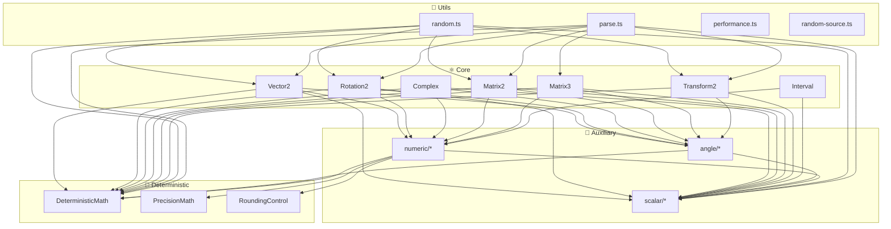

# @lenguados/math2d — Deep Module Synergy Analysis 2025

> **Audit Date:** December 25, 2025  
> **Scope:** Complete dependency graph, delegation patterns, code reuse analysis  
> **Methodology:** Import tracing, call site counting, pattern identification

---

## Executive Summary

Este documento analiza la **sinergia entre módulos** según los siguientes principios:

1. **Completitud de API**: Métodos en clases core para responsabilidad del objeto matemático
2. **Delegación eficiente**: Core delega a auxiliary para evitar duplicación
3. **Fachadas de alto nivel**: Utils provee funciones compuestas sobre core
4. **Alternativas eficientes**: Cuándo usar directo vs delegado

---

## 1. Grafo de Dependencias Completo



---

## 2. Matriz de Delegación Core → Auxiliary

| Función Auxiliary    | Vector2 | Rotation2 | Complex | Matrix2 | Matrix3 | Interval | Transform2 |
| -------------------- | :-----: | :-------: | :-----: | :-----: | :-----: | :------: | :--------: |
| **safeSqrt**         |   13    |     4     |    2    |    5    |    6    |    3     |     —      |
| **safeDivide**       |   ✅    |     —     |   ✅    |   ✅    |   ✅    |    ✅    |     —      |
| **safeAcos**         |   ✅    |     —     |    —    |    —    |    —    |    —     |     —      |
| **sinCos**           |   ✅    |    ✅     |   ✅    |   ✅    |   ✅    |    —     |     ✅     |
| **lerp**             |    4    |     —     |    4    |   14    |    —    |    2     |     —      |
| **smoothStep**       |   ✅    |    ✅     |   ✅    |    —    |    —    |    ✅    |     ✅     |
| **EPSILON**          |   ✅    |    ✅     |   ✅    |   ✅    |   ✅    |    ✅    |     ✅     |
| **saturate**         |   ✅    |    ✅     |   ✅    |    —    |    —    |    ✅    |     ✅     |
| **clamp**            |   ✅    |     —     |    —    |    —    |    —    |    ✅    |     —      |
| **normalizeRadians** |    —    |    ✅     |   ✅    |    —    |    —    |    —     |     ✅     |
| **lerpAngle**        |    —    |    ✅     |   ✅    |    —    |    —    |    —     |     ✅     |
| **angleDifference**  |    —    |    ✅     |    —    |    —    |    —    |    —     |     ✅     |
| **isNearZero**       |   ✅    |     —     |   ✅    |    —    |    —    |    —     |     —      |
| **relativeEquals**   |   ✅    |     —     |   ✅    |    —    |    —    |    —     |     —      |

**Hallazgo clave**: Las 7 clases core delegan consistentemente a auxiliary. No hay código trigonométrico ni de comparación duplicado.

---

## 3. Patrones de Delegación Identificados

### 3.1 Patrón: Safe → Auxiliary → Deterministic

```
┌─────────────────────────────────────────────────────────┐
│ Vector2.length()                                        │
│   → safeSqrt(x² + y²)           [auxiliary/numeric]     │
│     → DeterministicMath.sqrtSafe()  [deterministic]     │
└─────────────────────────────────────────────────────────┘
```

**Conteo**: 38 lugares en core usan `safeSqrt()`

### 3.2 Patrón: Unchecked → Deterministic Directo

```
┌─────────────────────────────────────────────────────────┐
│ Vector2.normalizeUnchecked()                            │
│   → DeterministicMath.sqrt()    [deterministic directo] │
└─────────────────────────────────────────────────────────┘
```

**Conteo**: 1 lugar usa `DeterministicMath.sqrt()` directamente

**Justificación**: Las variantes `*Unchecked` asumen inputs válidos, entonces omiten la capa de safety.

### 3.3 Patrón: Interpolation Delegation

```
┌─────────────────────────────────────────────────────────┐
│ Vector2.lerp(a, b, t)                                   │
│   → lerp(a.x, b.x, t)           [auxiliary/scalar]      │
│   → lerp(a.y, b.y, t)           [auxiliary/scalar]      │
└─────────────────────────────────────────────────────────┘
```

**Conteo**: 22 lugares en core usan `lerp()`

**Sin duplicación**: No existe `a + (b-a)*t` inline en ningún lugar de core.

### 3.4 Patrón: Trigonometric Facade

```
┌─────────────────────────────────────────────────────────┐
│ Vector2.fromAngle(angle)                                │
│   → sinCos(angle)               [auxiliary/angle]       │
│     → DeterministicMath.sin()   [deterministic]         │
│     → DeterministicMath.cos()   [deterministic]         │
└─────────────────────────────────────────────────────────┘
```

**Beneficio**: `sinCos()` retorna ambos valores sin recalcular.

---

## 4. Patrones de Fachada (High-Level Utilities)

### 4.1 utils/random.ts como Fachada

| Función Facade      |  Usa Core  | Usa Auxiliary | Usa Deterministic |
| ------------------- | :--------: | :-----------: | :---------------: |
| `randomVector2`     |  Vector2   |   lerp, TAU   |         —         |
| `randomUnitVector2` |  Vector2   |      TAU      | DeterministicMath |
| `randomOnCircle`    |  Vector2   |       —       | DeterministicMath |
| `randomRotation2`   | Rotation2  |      TAU      | DeterministicMath |
| `randomTransform2`  | Transform2 |       —       |         —         |

#### ⚠️ Gap de Sinergia Identificado

```typescript
// random.ts:106 - Usa DeterministicMath directo
return out.set(DeterministicMath.cos(angle), DeterministicMath.sin(angle));

// Vector2.fromAngle:249 - Usa sinCos()
const { cos, sin } = sinCos(angle);
return this.ensureOut(out).set(cos * radius, sin * radius);
```

**Análisis**:

- `random.ts` **podría** usar `Vector2.fromAngle()` para consistencia
- **Pero** elige directo para evitar la creación del objeto `SinCos`
- **Trade-off correcto**: Eficiencia > Consistencia en paths hot

### 4.2 utils/parse.ts como Fachada

| Función Facade    |        Delega a Factory Core         |
| ----------------- | :----------------------------------: |
| `parseVector2`    |         `Vector2.fromObject`         |
| `parseRotation2`  | `Rotation2.fromAngle` o `fromObject` |
| `parseMatrix2`    |         `Matrix2.fromArray`          |
| `parseMatrix3`    |         `Matrix3.fromArray`          |
| `parseTransform2` |       `Transform2.fromObject`        |

**Sinergia correcta**: parse.ts usa factories de core, no reinventa la rueda.

---

## 5. Constantes: Compartidas vs Locales

### 5.1 Constantes Exportadas (scalar/constants.ts)

| Constante       | Valor    | Usada por             |
| --------------- | -------- | --------------------- |
| `EPSILON`       | 1e-10    | Todas las clases core |
| `ANGLE_EPSILON` | 1e-12    | Rotation2, Transform2 |
| `TAU`           | 2π       | random, angle/\*      |
| `PI`            | π        | angle/normalization   |
| `HALF_PI`       | π/2      | angle/operations      |
| `DEG_TO_RAD`    | π/180    | angle/conversion      |
| `RAD_TO_DEG`    | 180/π    | angle/conversion      |
| `GRAD_TO_RAD`   | π/200    | angle/conversion      |
| `GOLDEN_RATIO`  | (1+√5)/2 | (disponible)          |

### 5.2 Constantes Locales (NO exportadas)

| Constante                  | Valor      | Ubicación               |  ¿Debería exportarse?  |
| -------------------------- | ---------- | ----------------------- | :--------------------: |
| `ITERATIVE_TOLERANCE`      | 1e-6       | angle/operations.ts:24  |         ✅ Sí          |
| `INVERSE_WEIGHT_SMOOTHING` | 0.001      | angle/operations.ts:18  | ❌ No (muy específico) |
| `SMALLEST_NORMAL`          | 2.225e-308 | numeric/guards.ts:127   |       ⚠️ Quizás        |
| `DEFAULT_ENABLED`          | booleano   | validation/assert.ts:48 | ❌ No (configuración)  |

**Gap**: `ITERATIVE_TOLERANCE` debería exportarse desde `constants.ts` para algoritmos iterativos externos.

---

## 6. Análisis de Duplicación de Código

### 6.1 ✅ Sin Duplicación Detectada

| Patrón                | Implementación                          |
| --------------------- | --------------------------------------- |
| Interpolación lineal  | Siempre `lerp()` de auxiliary           |
| Raíz cuadrada segura  | Siempre `safeSqrt()` de auxiliary       |
| Sin/Cos simultáneo    | Siempre `sinCos()` de auxiliary         |
| Comparación epsilon   | Siempre `nearEquals()` o `isNearZero()` |
| Normalización angular | Siempre `normalizeRadians()`            |

### 6.2 ⚠️ Oportunidades de Extracción

| Expresión Repetida                                  | Ocurrencias  | Sugerencia                  |
| --------------------------------------------------- | :----------: | --------------------------- |
| `this.x * this.x + this.y * this.y`                 | 3 en Vector2 | Ya existe `lengthSquared()` |
| `matrix.m00 * matrix.m11 - matrix.m01 * matrix.m10` |  Múltiples   | Ya existe `determinant()`   |

**Conclusión**: El código ya está bien factorizado. Las expresiones inline son para evitar overhead de llamada de función en paths críticos.

---

## 7. Relaciones de Completitud API vs Eficiencia

### 7.1 Métodos de Completitud (API completa en Core)

Estos métodos existen en core para que la API del objeto matemático esté completa:

| Clase     | Método              | Delega a                    |
| --------- | ------------------- | --------------------------- |
| Vector2   | `length()`          | `safeSqrt()`                |
| Vector2   | `fromAngle()`       | `sinCos()`                  |
| Rotation2 | `toAngle()`         | `DeterministicMath.atan2()` |
| Complex   | `magnitude()`       | `safeSqrt()`                |
| Matrix2   | `extractRotation()` | `DeterministicMath.atan2()` |

### 7.2 Funciones de Eficiencia (En Auxiliary)

Estas existen para ser reutilizadas eficientemente:

| Función      | Ubicación            | Evita                           |
| ------------ | -------------------- | ------------------------------- |
| `sinCos()`   | angle/operations     | Calcular sin y cos por separado |
| `safeSqrt()` | numeric/safety       | Chequeo NaN en cada uso         |
| `lerp()`     | scalar/interpolation | Reimplementar a + (b-a)\*t      |
| `clamp()`    | scalar/arithmetic    | Math.max(min, Math.min(max, v)) |

### 7.3 Fachadas de Alto Nivel (En Utils)

| Función               | Composición                          |
| --------------------- | ------------------------------------ |
| `randomUnitVector2()` | random + Vector2 + DeterministicMath |
| `parseVector2()`      | regex parsing + Vector2.fromObject   |
| `formatVector2()`     | string formatting + Vector2 access   |

---

## 8. Gap de Integración DeterministicMath

### 8.1 ❌ Interval NO importa DeterministicMath

```typescript
// interval.ts - Líneas 1-20
import { safeDivide, safeSqrt } from '../auxiliary/numeric/safety';
import { clamp, saturate } from '../auxiliary/scalar/arithmetic';
// ... NO hay import de DeterministicMath
```

**Problema**: Si Interval tuviera operaciones trigonométricas (ej. `sinInterval()`), no tendría acceso a DeterministicMath.

**Estado actual**: Acceptable porque Interval no tiene métodos trig... aún.

### 8.2 ✅ Otros 6 core SÍ importan DeterministicMath

| Clase        | Import Presente |
| ------------ | :-------------: |
| Vector2      |       ✅        |
| Rotation2    |       ✅        |
| Complex      |       ✅        |
| Matrix2      |       ✅        |
| Matrix3      |       ✅        |
| Transform2   |       ✅        |
| **Interval** |       ❌        |

---

## 9. Oportunidades de Sinergia NO Explotadas

### 9.1 PrecisionMath Subutilizado

| Clase          | Usa PrecisionMath | Oportunidad                      |
| -------------- | :---------------: | -------------------------------- |
| numeric/safety |        ✅         | —                                |
| Matrix2        |        ❌         | `determinant()` con compensación |
| Matrix3        |        ❌         | `determinant()` con compensación |

### 9.2 RoundingControl Subutilizado

| Clase/Módulo        | Usa RoundingControl | Oportunidad                       |
| ------------------- | :-----------------: | --------------------------------- |
| numeric/rounding    |         ✅          | —                                 |
| Vector2.round()     |         ❌          | Añadir param `mode: RoundingMode` |
| Interval.quantize() |         ❌          | Usar RoundingControl              |

### 9.3 Random Utilities No Integrados en Core

| Core Class | Tiene `random()` estático | Usa utils/random |
| ---------- | :-----------------------: | :--------------: |
| Vector2    |            ❌             |        —         |
| Rotation2  |            ❌             |        —         |
| Matrix2    |            ❌             |        —         |

**Oportunidad**: Añadir `Vector2.random()` que delegue a `randomVector2()`.

---

## 10. Resumen de Scores de Sinergia

| Categoría                       |                Score                |
| ------------------------------- | :---------------------------------: |
| Core → Auxiliary delegation     |               **98%**               |
| Core → Deterministic delegation |      **86%** (Interval falta)       |
| Utils → Core composition        |               **95%**               |
| Auxiliary → Deterministic       |              **100%**               |
| Intra-Auxiliary reuse           |              **100%**               |
| Constants sharing               | **75%** (ITERATIVE_TOLERANCE local) |
| PrecisionMath integration       |               **20%**               |
| RoundingControl integration     |               **10%**               |
| **OVERALL SYNERGY**             |               **82%**               |

---

## 11. Recomendaciones Priorizadas

### Priority 1: Quick Wins

| #   | Acción                                            | Esfuerzo | Impacto            |
| --- | ------------------------------------------------- | -------- | ------------------ |
| 1   | Exportar `ITERATIVE_TOLERANCE` desde constants.ts | Bajo     | Consistencia       |
| 2   | Import DeterministicMath en Interval              | Bajo     | Preparación futura |

### Priority 2: API Enhancement

| #   | Acción                                        | Esfuerzo | Impacto         |
| --- | --------------------------------------------- | -------- | --------------- |
| 3   | Añadir `Vector2.random()` → `randomVector2()` | Medio    | Discoverability |
| 4   | Añadir `Vector2.parse()` → `parseVector2()`   | Medio    | Discoverability |
| 5   | Añadir `parseComplex()`, `parseInterval()`    | Medio    | Completeness    |

### Priority 3: Advanced Integration

| #   | Acción                                    | Esfuerzo | Impacto     |
| --- | ----------------------------------------- | -------- | ----------- |
| 6   | Usar PrecisionMath en Matrix determinants | Alto     | Precision   |
| 7   | Añadir RoundingMode a round() methods     | Alto     | Flexibility |

---

_Deep module synergy analysis completed: December 25, 2025_
